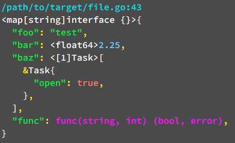

# Development Tools Package


Installation `go get github.com/jumale-go/dev`

## Dump Tool
It's used to print well-formatted and colorized variables
#### Example:
```go
import "github.com/jumale-go/dev"

type Task struct {
    open bool
}

value := map[string]interface{}{
    "foo": "test",
    "bar": 2.25,
    "baz": [1]*Task{
        &Task{true},
    },
    "func": func (a string, b int) (bool, error) {
        return true, nil
    },
}

dev.Dump(value)
```
the result will be<br>

#### Configuration
You can customize output as followed:

By default the result is printed out to os.Stdout, but you can change the destination by this setter
```go
dev.SetWriter(writer io.Writer)
```
By default each number is printed out with its own type as a prefix. You can disable the types by
```go
dev.Config.NumTypes = false
```
By default the Dump function also prints a location (file:line) where it's called. To disable location
```go
dev.Config.Location = false
```
By default tabulation in nested trees is two spaces. You can change it by
```go
dev.Config.Tab = "+" // now one tab will be the "+" character
```
Also you can chage colors:
```go
// note: there is a list of color-constants, like dev.FgWhite, dev.FgGreen etc
dev.Config.Color.String = dev.FgGreen // strings
dev.Config.Color.Number = ...         // all ints, uints and floats
dev.Config.Color.Bool = ...           // booleans
dev.Config.Color.Punctuation = ...    // colons, commas, ampersands
dev.Config.Color.Braces = ...         // round- curly- and square-braces
dev.Config.Color.Type = ...           // type prefixes before structs, arrays, slices, maps and numbers
dev.Config.Color.Func = ...           // function types
```
